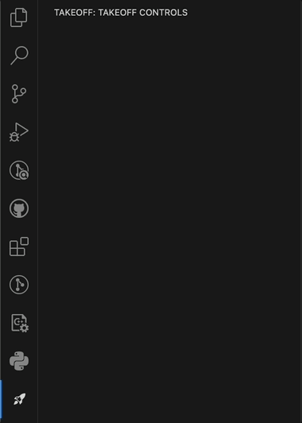

# Takeoff VSCode Extension (Alpha)

> **Alpha Release:** This extension is in early development. Features and stability may change.

## Introduction

Takeoff is a Visual Studio Code extension that enables effortless, click-based unit test generation powered by AI. Streamline your testing workflow and boost productivity with just a few clicks. Let your unit tests Takeoff! 🚀

## Features

- **Click-Based Workflow:** No need to write commands—just use the sidebar tool.
    

- **AI-Powered Test Generation:** Automatically generate unit tests for your code files.
    

## How to Use

1. **Install** the Takeoff extension from the VSCode marketplace.
2. **Open**  the extension tool from the sidebar.
4. **Click 🚀** in the extension panel to create tests for the file.
5. **Review the generated tests**.

---

Enjoy faster, smarter test creation with Takeoff!